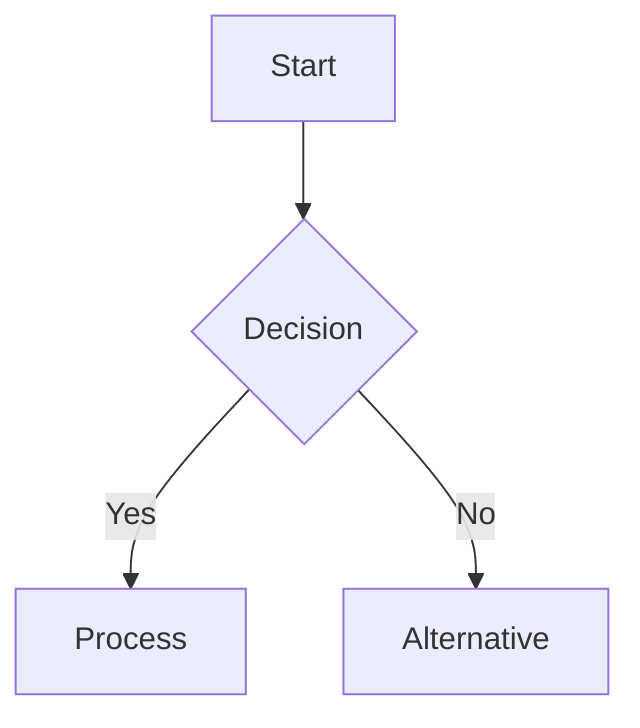

## Introduction

Brief introduction to your post topic. Hook the reader with an interesting question or statement.

## Problem Statement / Background

Explain what problem you're solving or the context for your topic.

## Main Content

Your main content here. Use proper markdown formatting:

### Code Examples

```python
# Example code block with syntax highlighting
def hello_world():
    print("Hello, World!")
    return "success"

# Add comments to explain complex logic
result = hello_world()
```

### Images and Media

{: width="700" height="400" }
_Caption for the image_

### Lists and Organization

#### Key Points:
- Use bullet points for clarity
- Keep items concise and actionable
- Group related concepts together

#### Technical Specifications:
1. First specification
2. Second specification
3. Third specification

### Diagrams (if using mermaid)



## Implementation / Solution

Show step-by-step implementation or solution to the problem.

## Results / Conclusion

- Summarize key findings
- Highlight important takeaways
- Suggest next steps or further reading

## References and Further Reading

- [Link 1](https://example.com) - Description of resource
- [Link 2](https://example.com) - Description of resource
- [Documentation](https://example.com) - Official documentation

---

> **Note**: Remember to optimize images before uploading and use descriptive filenames.
{: .prompt-tip }
